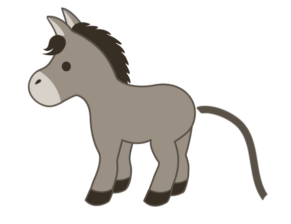

# Pin the tail

A game of pin the tail on the donkey

## Table of contents

- [General info](#general-info)
- [Screenshots](#screenshots)
- [Technologies](#technologies)
- [Setup](#setup)
- [Status](#status)

## General info

I wanted to write some more TypeScript not in React and also wanted to make a fun, simple game. What's more fun than pin the tail on the donkey?

It only works if you use a mouse.

## Screenshots



## Technologies

- HTML
- CSS
- TypeScript
- Vite

## Setup

To view this project visit the [demo](https://pin-the-tail.pages.dev/) or download the files, open a terminal in that folder and install locally using npm:

```
npm install
```

Run the app locally:

```
npm run dev
```

## Status

Project is: _finished_
